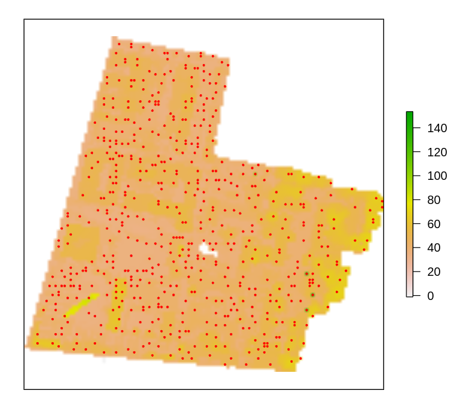
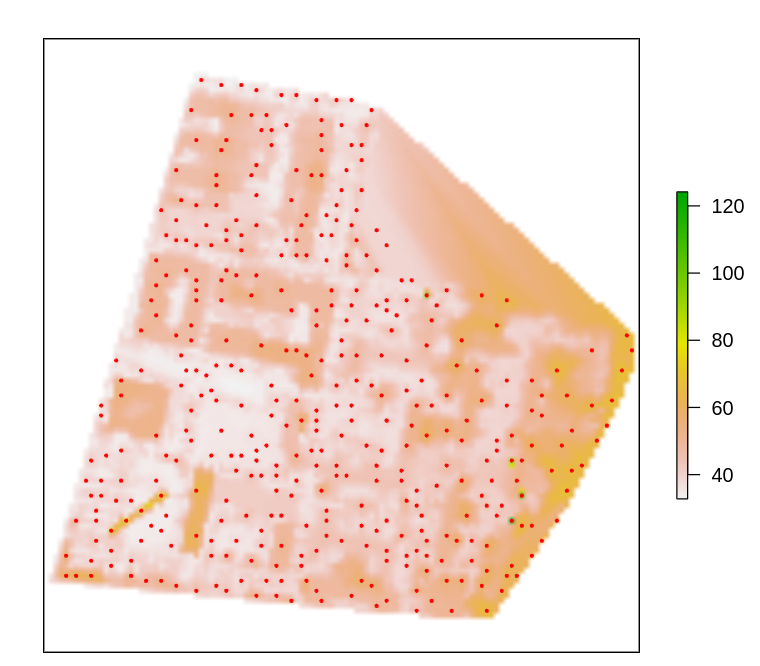
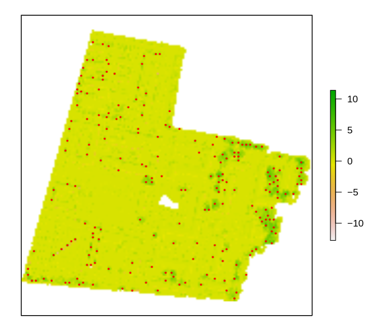
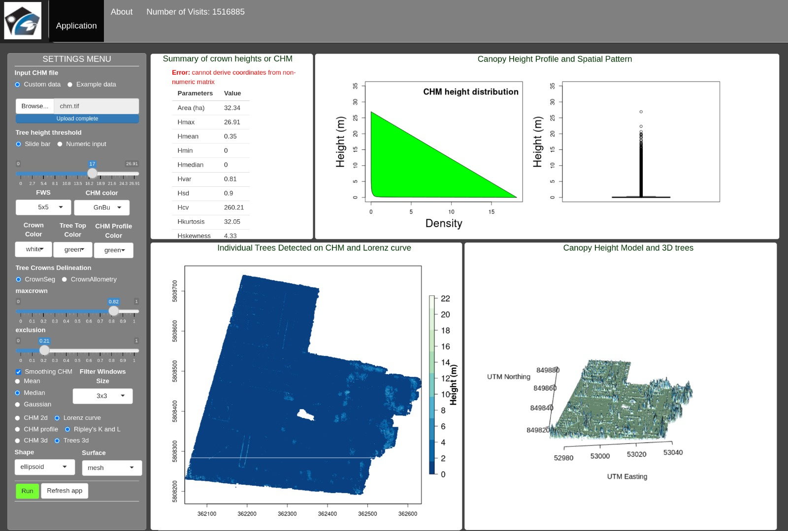
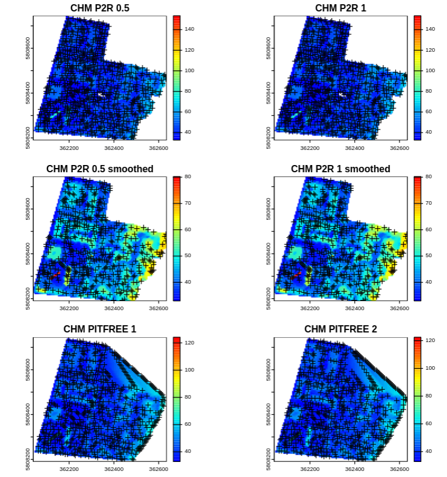
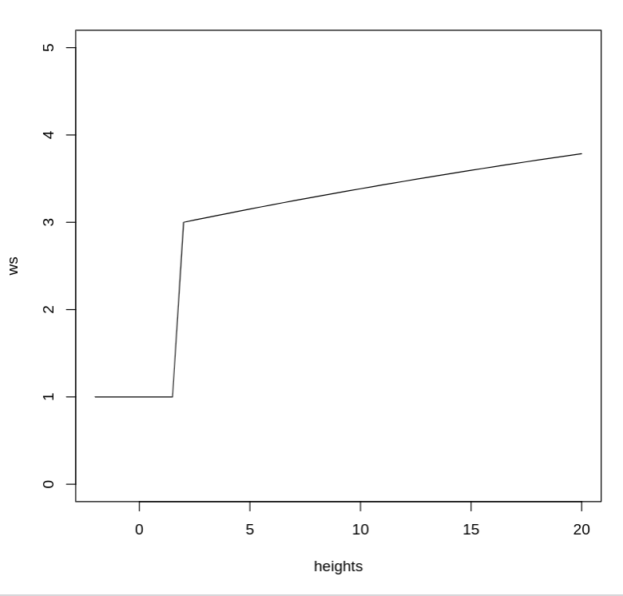

# Documentation - Random Group - Challenge Based Learning Project

### Members:
- Emmanuel Olguin	
- Raphael Kluge 		
- Nikolas Bertrand	

### Project:
Count the number of trees in Campus Golm. Estimate the area that is covered by trees on campus. How many
trees (in %) are deciduous?

### Course: 
Optical Remote Sensing - University of Potsdam Summer 2023

## Introduction:

For the purpose of completing this mini project, we explored multiple methods in the context of individual tree detection and forest analysis. 
We will go through each part seperately and explore the tools used, results and finally their respective challenges and limitations. 

## Part 1 - Counting the Trees:

The first part will cover the process taken to count trees. Here there are numerous tools that "can" be used.
Here LIDAR data was used to first create a rasterized Canopy height model and from there through indivual tree detection find the number of trees. 
In principle this task seems pretty straight forward, but one thing one needs to watch out for, namely the outer limits of the LIDAR and the crane that is present. 

### TOOLS used: 
Multiple tools were used, also for the purpose of verifying the result
#### R packages:
lidR
ForestTools
treetop
#### Python programs: 
PDAL, GDAL

### APPROACH 1: lidR & ForestTools 

The first approach was to stay within R. 
Here we first read a Las file and run multiple different algorithm and settings to find a result a satisfactory result.
These algorithms are the points to raster, dsmtin and the pit free algorithm 

```R
library(lidR)
library(raster)
library(ForestTools)

las <- readLAS("/home/nibe/PROJECTS/golm_tree_analysis/data/Golm_May06_2018_Milan_UTM33N_WGS84_6digit_cl.las", filter = "-keep_first")
col <- height.colors(15)


# Points-to-raster algorithm with a resolution of 1 meter
CHM <- rasterize_canopy(las, res = 5, p2r(), pkg = "raster")
lin <- function(x){x * 0.06 + 0.5}
ttops <- vwf(CHM, winFun = lin, minHeight = 2)

plot(CHM, xlab = "", ylab = "", xaxt = 'n', yaxt = 'n')
#plot(ttops, col = "red", pch = 20, cex = 0.5, add = TRUE)
#plot(CHM, col = col)
sp_summarise(ttops)


# Points-to-raster algorithm with a resolution of 0.5 meters replacing each
# point by a 20-cm radius circle of 8 points
CHM <- rasterize_canopy(las, res = 5, p2r(0.2), pkg="raster")
lin <- function(x){x * 0.06 + 0.5}
ttops <- vwf(CHM, winFun = lin, minHeight = 2)

plot(CHM, xlab = "", ylab = "", xaxt = 'n', yaxt = 'n')
plot(ttops, col = "red", pch = 20, cex = 0.5, add = TRUE)
plot(CHM, col = col)
sp_summarise(ttops)

# Basic triangulation and rasterization of first returns
CHM <- rasterize_canopy(las, res = 5, dsmtin(), pkg = "raster")
lin <- function(x){x * 0.06 + 0.5}
ttops <- vwf(CHM, winFun = lin, minHeight = 2)

plot(CHM, xlab = "", ylab = "", xaxt = 'n', yaxt = 'n')
plot(ttops, col = "red", pch = 20, cex = 0.5, add = TRUE)
plot(CHM, col = col)
sp_summarise(ttops)

# Khosravipour et al. pitfree algorithm
CHM <- rasterize_canopy(las, res = 5, pitfree(c(0,2,5,10,15), c(0, 1.5)), pkg = "raster")
lin <- function(x){x * 0.06 + 0.5}
ttops <- vwf(CHM, winFun = lin, minHeight = 2)

plot(CHM, xlab = "", ylab = "", xaxt = 'n', yaxt = 'n')
plot(ttops, col = "red", pch = 20, cex = 0.5, add = TRUE)
plot(CHM, col = col)
sp_summarise(ttops)
writeRaster(CHM,paste0(wd,"test.tif"),"GTiff")
```
#### Results
- Treecount 531
- Treecount 587
- Treecount 386
- Treecount 386


For the p2r algorithm the plot looks like this:





On the otherhand for the pitfree algorithm the plot is as follows:





### Approach 2: Python PDAL + GDAL pipelines + R Foresttools
First we start by running the following two scripts in the terminal using the below command. Once to find the DTM and once for DSM. 
and after that run gdal to create the CHM
```SHELL
#!/bin/bash
pdal pipeline dsm_pipeline.json &&
pdal pipeline dtm_pipeline.json &&
gdal_calc.py -A dtm.tif -B dsm.tif --calc="B-A" --outfile chm2.tif
```
The DSM pipeline
```json
{
    "pipeline":[
        "~/PROJECTS/golm_tree_analysis/data/Golm_May06_2018_Milan_UTM33N_WGS84_6digit_cl.las",
        {
            "type":"filters.reprojection",
            "in_srs":"EPSG:32633",
            "out_srs":"EPSG:32633"
        },
        {
            "type":"filters.range",
            "limits":"returnnumber[1:1]"
        },

        {
            "type": "writers.gdal",
            "filename":"dsm.tif",
            "output_type":"idw",
            "gdaldriver":"GTiff",
            "resolution": 4,
            "radius": 1

        }
    ]
}
```
The DTM pipeline:

```json
{
    "pipeline":[
         "~/PROJECTS/golm_tree_analysis/data/Golm_May06_2018_Milan_UTM33N_WGS84_6digit_cl.las",
        {
            "type":"filters.reprojection",
            "in_srs":"EPSG:32633",
            "out_srs":"EPSG:32633"
        },
        {
          "type":"filters.assign",
          "assignment":"Classification[:]=0"
        },
        {
          "type":"filters.elm"
        },
        {
          "type":"filters.outlier"
        },
        {

          "type":"filters.smrf",
          "ignore":"Classification[7:7]",
          "slope":0.2,
          "window":16,
          "threshold":0.45,
          "scalar":1.2
        },
        {
          "type": "writers.gdal",
          
          "filename":"dtm.tif",
          "output_type":"idw",
          "gdaldriver":"GTiff",
          "resolution": 4,
          "radius": 1
        },
        {
          "type":"filters.range",
          "limits":"Classification[2:2]"
        }
    ]
}
```
Next we run an R script that uses the generated CHM to count the trees. 
```R
library(ForestTools)
library(raster)
library(tiff)

CHM = raster("~/PROJECTS/golm_tree_analysis/src/python_testing/chm2.tif")

lin <-  function(x){x*0.06 +0.5} 
ttops <- vwf(CHM, lin, minHeight = 2)
plot(CHM, xlab = "", ylab = "", xaxt = 'n', yaxt = 'n')
plot(ttops, col = "red", pch = 20, cex = 0.5, add = TRUE)
sp_summarise(ttops)
```
This results in a treecount of 265 (deducted 5 because of the crane see image below)





### Approach 3 Treetop Shiny application: 
Treetop was useless, how did they get the same results as in the paper. HOW. No matter what CHM as used, no tree count no option only some buttons that changed maybe the colors but nothing else:



## Results discussion

The results are not satisfactory, they only gave me an idea about how many trees approximately. For example the Trees in front of the cafeteria / mensa, no matter how much values were changed, could not 
detect them. Thus I would argue that the final result for the treecount is between 300 and 350. Somewhere in the middle between approach 1 and approach 2.  We did not add all approaches and script tweaks, otherwise this document would be 50 pages long. And that is not the goal. 

The best change in results was achieved by increasing the resolution to 5. Many other tweaks did hardly do anything.

### Challenges and limitations
It is always easy to push the fault to the tools, but a better documentation or guidance in form of guide would have been awesome. BUT the documentation for the lidr package was topnotch including examples. 
Foresttools also provided a good example but in the end it all came down to tweaking the numbers, and one could bet, that someone more experience would immediately see the mistake and voila ~300 perfectly detected trees. 

Another challenge, was confirming the tree count, while using the mensa as an example is easy there are a lot of other small trees and larger bushes accross the campus, making this rather difficult. And least when talking with the other groups one could confirm that the trees are about ~300. Whether or not that is correct is to be determined.  

# BUT HOLD ON! LIDR to the rescue

```R
library(lidR)

las <- readLAS("~/PROJECTS/golm_tree_analysis/data/Golm_May06_2018_Milan_UTM33N_WGS84_6digit_cl.las", select = "xyzr", filter = "-drop_z_below 20, -drop_z-above 40")


# Point-to-raster 2 resolutions
chm_p2r_05 <- rasterize_canopy(las, 5, p2r(subcircle = 0.2), pkg = "terra")
chm_p2r_1 <- rasterize_canopy(las, 5, p2r(subcircle = 0.2), pkg = "terra")

# Pitfree with and without subcircle tweak
chm_pitfree_05_1 <- rasterize_canopy(las, 5, pitfree(), pkg = "terra")
chm_pitfree_05_2 <- rasterize_canopy(las, 5, pitfree(subcircle = 0.2), pkg = "terra")

# Post-processing median filter
kernel <- matrix(1,3,3)
chm_p2r_05_smoothed <- terra::focal(chm_p2r_05, w = kernel, fun = median, na.rm = TRUE)
chm_p2r_1_smoothed <- terra::focal(chm_p2r_1, w = kernel, fun = median, na.rm = TRUE)


f <- function(x) {
  y <- 2.6 * (-(exp(-0.02*(x-2)) - 1)) + 3
  y[x < 2] <- 3
  y[x > 15] <- 15
  return(y)
}

heights <- seq(-2,20,0.5)
ws <- f(heights)
plot(heights, ws, type = "l",  ylim = c(0,5))


ttops_chm_p2r_05 <- locate_trees(chm_p2r_05, lmf(f))
ttops_chm_p2r_1 <- locate_trees(chm_p2r_1, lmf(f))
ttops_chm_pitfree_05_1 <- locate_trees(chm_pitfree_05_1, lmf(f))
ttops_chm_pitfree_05_2 <- locate_trees(chm_pitfree_05_2, lmf(f))
ttops_chm_p2r_05_smoothed <- locate_trees(chm_p2r_05_smoothed, lmf(f))
ttops_chm_p2r_1_smoothed <- locate_trees(chm_p2r_1_smoothed, lmf(f))

print(nrow(ttops_chm_p2r_05))
print(nrow(ttops_chm_p2r_1))
print(nrow(ttops_chm_pitfree_05_1))
print(nrow(ttops_chm_pitfree_05_2 ))
print(nrow(ttops_chm_p2r_05_smoothed))
print(nrow(ttops_chm_p2r_1_smoothed))

par(mfrow=c(3,2))
col <- height.colors(50)
plot(chm_p2r_05, main = "CHM P2R 0.5", col = col); plot(sf::st_geometry(ttops_chm_p2r_05), add = T, pch =3)
plot(chm_p2r_1, main = "CHM P2R 1", col = col); plot(sf::st_geometry(ttops_chm_p2r_1), add = T, pch = 3)
plot(chm_p2r_05_smoothed, main = "CHM P2R 0.5 smoothed", col = col); plot(sf::st_geometry(ttops_chm_p2r_05_smoothed), add = T, pch =3)
plot(chm_p2r_1_smoothed, main = "CHM P2R 1 smoothed", col = col); plot(sf::st_geometry(ttops_chm_p2r_1_smoothed), add = T, pch =3)
plot(chm_pitfree_05_1, main = "CHM PITFREE 1", col = col); plot(sf::st_geometry(ttops_chm_pitfree_05_1), add = T, pch =3)
plot(chm_pitfree_05_2, main = "CHM PITFREE 2", col = col); plot(sf::st_geometry(ttops_chm_pitfree_05_2), add = T, pch =3)

```

This approach gave good results and plot BUT, it needs tweaking in terms of numbers 
best result I got was the following:

```Shell

[1] 509
[1] 509
[1] 386
[1] 372
[1] 325
[1] 325
```
The resulting plots look as follows: 





And the dynamic Window size in correlation to height looks like this: 


## Part 2 - Estimated area covered by trees:

## Part 3 - Percentage of deciduous trees:

## Indivual observations, remarks:
Below is a small little bonus for the Lecturer with some remarks, feedback. 
### N. Bertrand
One of the largest challenge was finding the tools and than actually get it to work. From a CS background
speaking the documentation of a lot of tools is at times hardly existent and if available pretty bad. Normally you would expect the documentation for a new tool 
released in 2022 with accomponying papers would have at least some form of documentation or guidance. Don't get me started on the R programming language, tooling is bad... 

Otherwise the project was OK, though in retrospect I am happy to have majored CS. While we have our headaches and sleepless nights, I can't remember the last time I was so mad, angry and shouting while trying to get software to run. 


## Bibliography
- Silva, C.A., Hudak, A.T., Vierling, L.A., Valbuena, R., Cardil, A., Mohan, M., de Almeida, D.R.A., Broadbent, E.N., Almeyda Zambrano, A.M., Wilkinson, B. and Sharma, A., 2022. treetop: A Shiny‐based application and R package for extracting forest information from LiDAR data for ecologists and conservationists. Methods in Ecology and Evolution, 13(6), pp.1164-1176.

- Mohan, M., Silva, C., Klauberg, C., Jat, P., Catts, G., Cardil, A., & Dia, M. (2017). Individual tree detection from unmanned aerial vehicle (UAV) derived canopy height model in an open canopy mixed conifer Forest. Forests, 8(9), 340. https://doi.org/10.3390/f8090340

- https://www.simonplanzer.com/articles/lidar-chm/
- https://cran.r-project.org/web/packages/ForestTools/vignettes/treetop_analysis.html
- https://r-lidar.github.io/lidRbook/index.html
 
